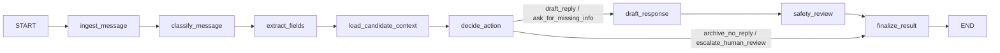
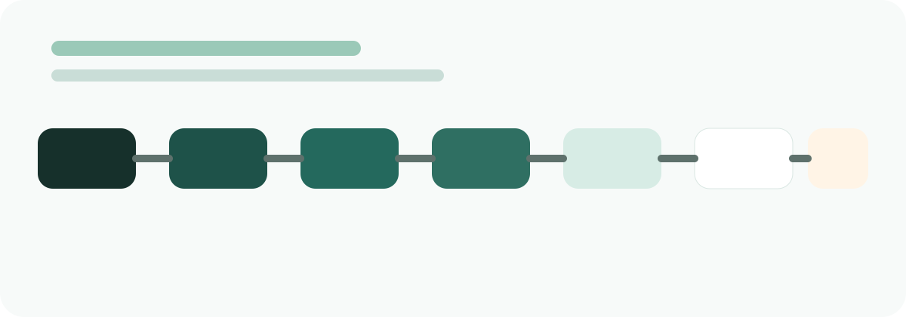

# SignalDraft

SignalDraft is a polished, local-first AI inbox triage and reply drafting agent for job seekers. Paste a recruiter outreach, interview message, networking reply, or application update and the app will classify it, extract structured data, choose the safest next action, draft a response when appropriate, explain its reasoning, and route risky cases to human review.


## Why this project is recruiter-impressive

- It solves a concrete workflow that many candidates deal with daily: recruiter replies, scheduling, assessments, and sensitive offer conversations.
- It uses current agent tooling intentionally instead of forcing a generic chatbot pattern.
- It stays cheap and local-first: SQLite for persistence, Streamlit for the demo UI, FastAPI for the service layer, and OpenAI as the only paid dependency.
- It is easy to explain in an interview because the workflow is explicit, typed, and deterministic where safety matters.

## Core capabilities

- Paste an inbound message into the app and run an analysis.
- Classify messages into recruiter, interview, scheduling, assessment, rejection, offer, networking, follow-up, spam, or unknown buckets.
- Extract structured fields such as company, role title, deadlines, sponsorship mentions, compensation mentions, dates, and requested actions.
- Route each message into one of four outcomes: `draft_reply`, `ask_for_missing_info`, `archive_no_reply`, or `escalate_human_review`.
- Generate concise draft replies personalized with the saved candidate profile.
- Flag risky messages for manual review and preserve the reasoning behind that decision.
- Persist run history and profile data locally in SQLite.
- Visualize workflow steps in the UI for demos and debugging.

## Why LangGraph, LangChain, and LangSmith

### LangGraph

LangGraph manages the inbox triage workflow as an explicit state graph instead of a monolithic prompt chain. That gives the project:

- clear node boundaries
- deterministic routing
- checkpoint support
- a natural place to insert human review

### LangChain

LangChain handles:

- OpenAI chat model integration
- clean prompt templates
- typed structured outputs with Pydantic models for classification, extraction, decision support, and safety review

### LangSmith

The project is LangSmith-ready out of the box:

- LangSmith environment variables are exposed in `.env.example`
- the LLM service uses `traceable` decorators where tracing is most useful
- the local evaluation scaffold includes comments showing where LangSmith dataset and evaluation hooks plug in

When `LANGSMITH_TRACING=true` and the API key is configured, runs become traceable without changing application code.

## Architecture

### Stack

- Backend: FastAPI
- Workflow engine: LangGraph
- LLM integration: LangChain + OpenAI
- Tracing and eval readiness: LangSmith
- Persistence: SQLite
- Frontend: Streamlit

### Project structure

```text
app/
  api/          FastAPI routes
  db/           SQLite database and repositories
  evals/        Local evaluation runner
  graph/        LangGraph state, nodes, graph builder
  models/       Pydantic schemas and enums
  prompts/      Prompt templates
  services/     LLM service, heuristics, orchestration
  ui/           Streamlit frontend
  utils/        Config and logging
data/
  eval_dataset.json
docs/
  screenshots/
scripts/
  run_eval.py
tests/
```

### Graph flow





## Workflow details

### State schema

The graph uses a strongly typed state object with fields including:

- `raw_message`
- `normalized_message`
- `message_type`
- `urgency`
- `extracted`
- `candidate_profile`
- `recommended_action`
- `draft_reply`
- `needs_human_review`
- `review_reason`
- `explanation`
- `workflow_steps`
- `errors`

### Routing policy

SignalDraft escalates to human review when it detects:

- visa or sponsorship questions
- compensation or negotiation language
- legal or contract language
- contradictory scheduling options
- unclear or risky deadline phrasing

It archives low-value spam and low-signal promotional content. It asks for missing info when a response is appropriate but critical details are missing. Otherwise it drafts a reply.

## Demo scenarios

The Streamlit app includes three one-click demo messages:

1. Recruiter outreach
2. Interview scheduling request with missing details
3. Compensation and sponsorship message that escalates to human review

These live in [data/eval_dataset.json](/Users/mayowaadesanya/Documents/Projects/SignalDraft/data/eval_dataset.json) and are also used by the local evaluation flow.

## Setup

### 1. Create a virtual environment

```bash
python3 -m venv .venv
source .venv/bin/activate
```

### 2. Install dependencies

```bash
pip install -r requirements.txt
```

### 3. Configure environment variables

```bash
cp .env.example .env
```

Required for OpenAI-powered runs:

- `OPENAI_API_KEY`

Optional but recommended:

- `OPENAI_MODEL`
- `LANGSMITH_TRACING`
- `LANGSMITH_API_KEY`
- `LANGSMITH_PROJECT`

If no OpenAI key is set, SignalDraft falls back to deterministic heuristics so the app can still boot, run tests, and demonstrate the product flow locally.

## Run the backend

```bash
uvicorn app.main:app --reload
```

FastAPI endpoints:

- `POST /analyze`
- `GET /runs`
- `GET /runs/{id}`
- `POST /runs/{id}/review`
- `POST /runs/{id}/mock-send`
- `GET /profile`
- `PUT /profile`
- `GET /health`

## Run the frontend

In another terminal:

```bash
streamlit run app/ui/streamlit_app.py
```

By default the UI calls the backend at `http://127.0.0.1:8000`. Override that with `SIGNALDRAFT_API_BASE_URL` if needed.

## Run tests

```bash
pytest
```

## Run local evaluations

```bash
python scripts/run_eval.py
```

This writes a local summary to `outputs/evals/summary.json` and reports:

- classification correctness
- extraction completeness
- routing correctness
- draft usefulness
- escalation correctness

## API and persistence notes

- Candidate profile data is stored locally in SQLite and automatically seeded on first run.
- Analysis runs are stored as serialized Pydantic models in SQLite for quick iteration and easy export.
- LangGraph checkpoints use a SQLite saver when available and fall back to in-memory checkpointing otherwise.
- The app includes approve, reject, and mock-send actions, but does not integrate with any real email provider.

## Design tradeoffs

- SQLite instead of a cloud database keeps setup under 10 minutes and avoids recurring cost.
- Streamlit keeps the demo lightweight and fast to ship, while FastAPI preserves a clean service boundary.
- The decision engine is hybrid: LLM-assisted for understanding, deterministic for safety-sensitive routing.
- Heuristic fallback exists so the app remains usable for local demos and tests even before an API key is configured.
- No email sending integration is included by design to keep the project safe, local, and cheap.

## Future improvements

- Add richer calendar-aware scheduling suggestions.
- Add authenticated multi-profile support for multiple job seekers.
- Expand the LangSmith evaluation pipeline with dataset upload and experiment comparison.
- Add a richer human review queue with side-by-side original message and draft diffing.
- Add exportable analytics on recruiter response rates and message categories.

## Resume-ready bullets

- Built a local-first AI inbox triage agent for job seekers using FastAPI, LangGraph, LangChain, Streamlit, and SQLite.
- Designed a typed multi-step workflow that classifies recruiter and interview emails, extracts structured data, drafts responses, and escalates risky cases for human review.
- Added LangSmith-ready tracing and a local evaluation harness with seeded datasets covering classification, extraction, routing, and draft quality.
